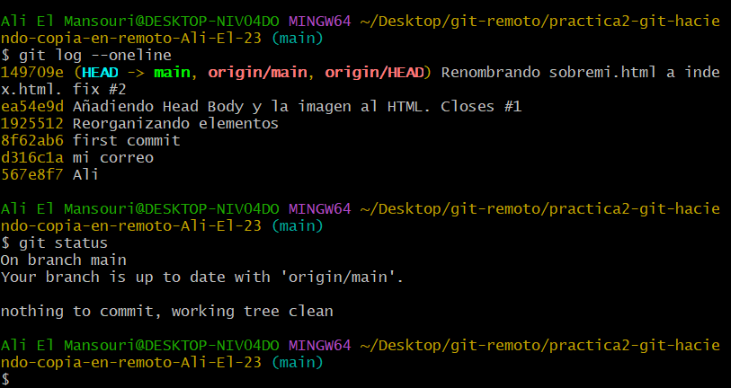
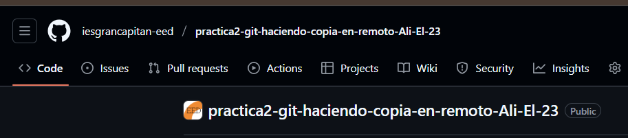
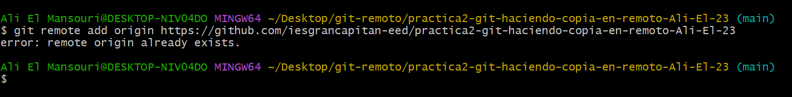
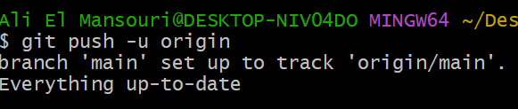
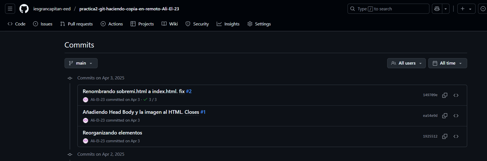

#  Tarea 4.6b – Flujo básico en Git (local → GitHub)

En esta práctica vas a **publicar en GitHub** el repositorio que creaste en la *Tarea 4.6 «Flujo básico en Git. Local»*.  
El objetivo es **subir todos los commits locales hasta «mi imagen» a un repositorio remoto vacío** y documentar cada paso con capturas de pantalla.

---

## Estado del repositorio local

```bash
git log --oneline --decorate      
git status                       
```
  


---

## Crear el repositorio remoto vacío

1. Acepta la tarea (classroom / enlace del profesor).  
2. GitHub mostrará la pantalla **“Quick setup”** con la URL del remoto.

Captura esa pantalla:  


---

## Conectar el remoto desde Git Bash

En tu repositorio local:

```bash
git remote add origin https://github.com/iesgrancapitan-eed/practica2-git-haciendo-copia-en-reto-lmrin.git

```

Haz una captura de la ejecución:  
En mi caso ya existe ya que lo clone.


Comprueba que el remoto está listo:

```bash
git remote -v
```

---

## Primer *push* al remoto

Empuja tu rama principal:

```bash
git push -u origin main  
```

Captura la salida del push:  


Verifica en GitHub que aparecen todos los commits:  


---

## Añadir `README.md` con esta guía y las capturas
Desde Git Bash (local):

```bash
git add README.md
git commit -m "Añadido README con instrucciones y capturas"
```

Captura el estado limpio después del commit:  


---

## Sincronizar cambios

```bash
git push
```

Captura el resultado:  


---

## Resultado final

Visita el repositorio en GitHub y comprueba:

- Rama principal correcta (`master`/`main` )  
- Todos los commits hasta **«mi imagen»**   
- `README.md` con las capturas 

Captura la vista general del repo:  


---

### Referencias útiles

- [Fundamentos de Git – Obteniendo un repositorio Git](https://git-scm.com/book/es/v2/Fundamentos-de-Git-Obteniendo-un-repositorio-Git)
- [Fundamentos de Git – Compartiendo repositorios](https://git-scm.com/book/es/v2/Git-en-un-Servidor-Enviando-por-Primera-Vez)
- [Convención sobre nombres de ramas](https://git-scm.com/docs/git-branch)

---

